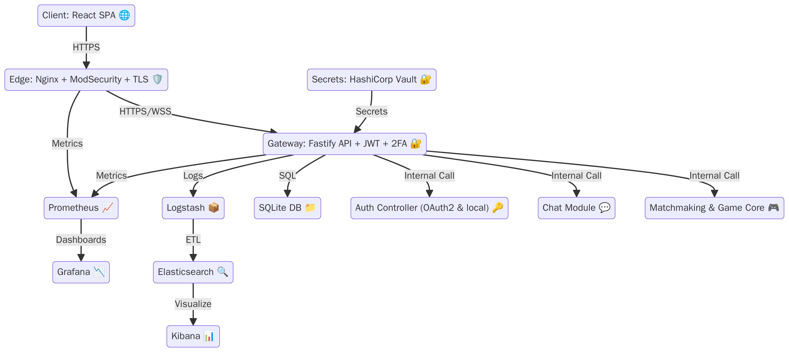

# ft_transcendence 🏓

A real-time Pong-style game built by four 42-Network students.
**North-star:** _< 30 s from page-load → fair online match._



---

## 🚀 Quick start

```bash
git clone https://github.com/42-team/ft_transcendence.git
cd ft_transcendence
corepack enable
corepack prepare pnpm@9.1.0 --activate    # one-time: installs pnpm
pnpm install --frozen-lockfile            # also installs Husky hooks

docker compose -f infra/compose.dev.yml up --build
```

# 🗂️ Repository layout

| Path              | Purpose                                | CODEOWNER |
| ----------------- | -------------------------------------- | --------- |
| `apps/web`        | React SPA (TypeScript + Tailwind)      | @dev2     |
| `apps/server`     | Fastify API + WebSocket gateway        | @dev3     |
| `packages/core`   | Game physics & shared TypeScript types | @dev1     |
| `infra/compose.*` | Docker & CI/CD definitions             | @dev4     |
| `docs/adr`        | Architecture Decision Records          | all       |

## 📂 Project Structure

```
ft_transcendence/
├── apps/                      # Application code
│   ├── server/                # Backend API (Fastify)
│   └── web/                   # Frontend SPA (React + TypeScript)
│
├── packages/                  # Shared libraries
│   └── core/                  # Shared types and game physics
│
├── infra/                     # Infrastructure configuration
│   ├── compose.dev.yml        # Development environment
│   ├── compose.test.yml       # Testing environment
│   └── Dockerfile.test        # Test environment container
│
├── docs/                      # Documentation
│   └── assets/                # Documentation assets (images)
│
├── .github/                   # GitHub configuration
│   ├── workflows/             # GitHub Actions CI/CD workflows
│   └── pull_request_template.md  # PR template
│
├── .husky/                    # Git hooks for code quality
│
├── test/                      # Test utilities and integration tests
│
├── package.json               # Root package configuration
├── pnpm-workspace.yaml        # PNPM workspace configuration
├── eslint.config.cjs          # ESLint configuration
├── vitest.config.mjs          # Vitest test framework config
└── README.md                  # Project documentation
```

The project follows a monorepo structure with clear separation of concerns:

- **Apps**: Contains end-user applications (frontend/backend)
- **Packages**: Houses shared code and libraries used across apps
- **Infrastructure**: Defines deployment and environment configurations
- **Testing**: Centralized test utilities and integration tests
- **Automation**: CI/CD workflows and Git hooks ensure code quality

# 📡 Tech stack & subject modules

| Area          | Tech                                               | Subject module fulfilled         |
| ------------- | -------------------------------------------------- | -------------------------------- |
| Edge security | **Nginx + ModSecurity**                            | WAF / Vault (major)              |
| Auth          | Fastify + JWT + TOTP (2-FA)                        | 2-FA + JWT (major)               |
| Realtime      | WebSocket (socket.io)                              | Remote players (major)           |
| Persistence   | SQLite via Prisma                                  | Database (minor)                 |
| Observability | Logstash → Elasticsearch → Kibana / Prom → Grafana | ELK (major) + Monitoring (minor) |
| Styling       | Tailwind CSS                                       | Front-end framework (minor)      |
| Build         | Docker Compose + GitHub Actions                    | —                                |

# 🏗️ Contributing workflow

Create a branch: git checkout -b feat/<scope>

Follow the DoD checklist in .github/PULL_REQUEST_TEMPLATE.md

Run tests & linter: docker compose exec server pnpm test

Open a PR to dev; required reviewers = CODEOWNER + 1 peer

# 🧭 Roadmap (sprints)

| Sprint | Focus                            | Modules delivered   |
| ------ | -------------------------------- | ------------------- |
| 0      | Tooling, CI, “Hello World” stack | —                   |
| 1      | Local & LAN play                 | Remote players + DB |
| 2      | Accounts, JWT                    | Standard auth       |
| 3      | 2-FA & Chat                      | 2-FA / JWT          |
| 4      | Observability                    | ELK + Prometheus    |
| 5      | Security hardening               | WAF / Vault         |
| 6      | Mobile polish                    | Responsive UI       |
